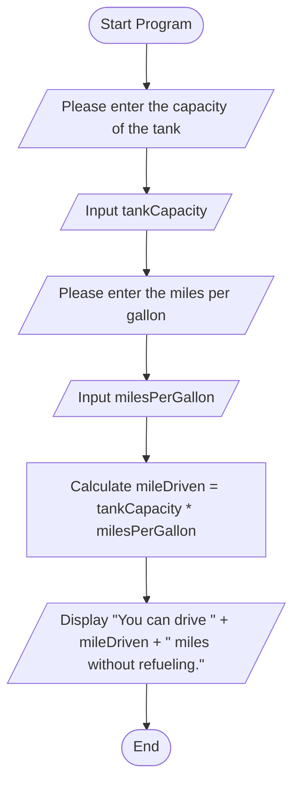

## input

•	Capacity of the tank (tankCapacity)
•	Miles per gallon (milesPerGallon)

## Process
      calculate distance as tank Capacity * miles Per Gallon.
## Output

•	The distance that can be driven without refueling (mileDriven).

## Pseudocode for Distance Calculation

step1: **Start**
   
step2: . **Initialize Variables**
   
   - Declare `int miles Per Gallon`
   - Declare `int tankCapacity`
   - Declare `int mileDriven`
step3: **Input Tank Capacity, Miles Per Gallon**
   
step4:**Calculate Distance**
     `mile Driven = tankCapacity * milesPerGallon`
    
step5: **Print Distance**
    
step6: **End**

