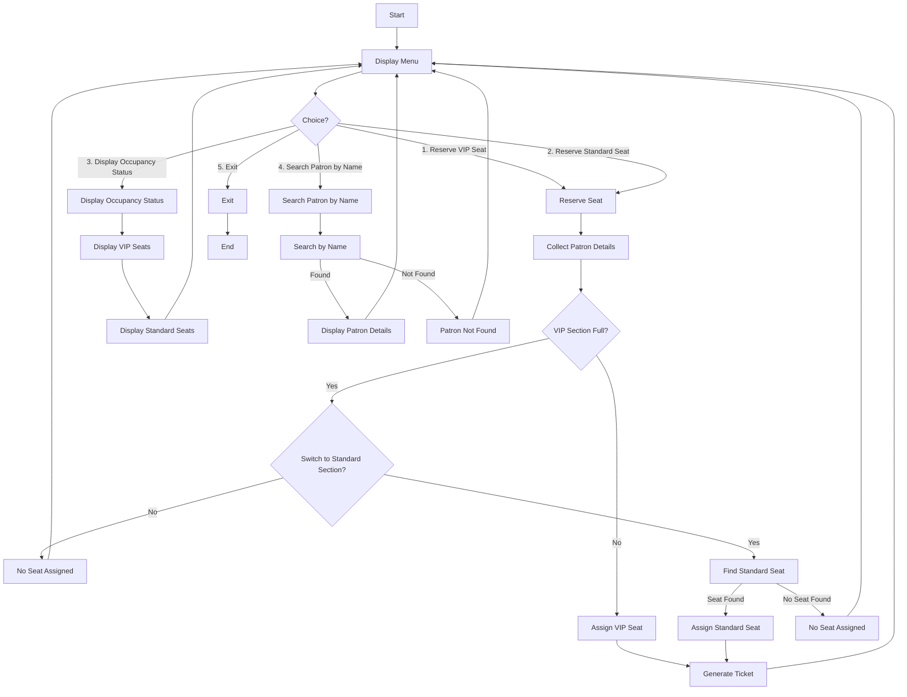

```mermaid
graph TD;
    A[Start] --> B[Display Menu];
    B --> C{Choice?};
    C -->|1. Reserve VIP Seat| D[Reserve Seat];
    C -->|2. Reserve Standard Seat| D;
    C -->|3. Display Occupancy Status| E[Display Occupancy Status];
    C -->|4. Search Patron by Name| F[Search Patron by Name];
    C -->|5. Exit| G[Exit];
    
    D --> H[Collect Patron Details];
    H --> I{VIP Section Full?};
    I -->|No| J[Assign VIP Seat];
    I -->|Yes| K{Switch to Standard Section?};
    K -->|No| L[No Seat Assigned];
    K -->|Yes| M[Find Standard Seat];
    M -->|Seat Found| N[Assign Standard Seat];
    M -->|No Seat Found| O[No Seat Assigned];
    
    J --> P[Generate Ticket];
    N --> P;
    L --> B;
    O --> B;
    P --> B;
    
    E --> Q[Display VIP Seats];
    Q --> R[Display Standard Seats];
    R --> B;
    
    F --> S[Search by Name];
    S -->|Found| T[Display Patron Details];
    S -->|Not Found| U[Patron Not Found];
    T --> B;
    U --> B;
    G --> V[End];
```
