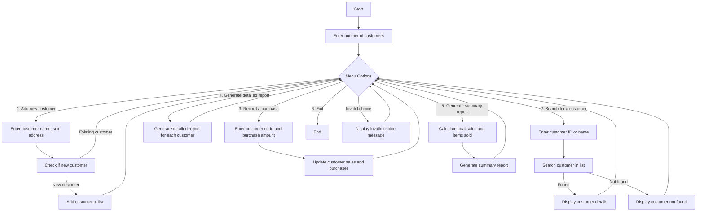

```mermaid
flowchart TD
    A[Start] --> B[Enter number of customers]
    B --> C{Menu Options}
    
    C -->|1. Add new customer| D[Enter customer name, sex, address]
    D --> E[Check if new customer]
    E -->|New customer| F[Add customer to list]
    F --> C
    E -->|Existing customer| C
    
    C -->|2. Search for a customer| G[Enter customer ID or name]
    G --> H[Search customer in list]
    H -->|Found| I[Display customer details]
    H -->|Not found| J[Display customer not found]
    I --> C
    J --> C
    
    C -->|3. Record a purchase| K[Enter customer code and purchase amount]
    K --> L[Update customer sales and purchases]
    L --> C
    
    C -->|4. Generate detailed report| M[Generate detailed report for each customer]
    M --> C
    
    C -->|5. Generate summary report| N[Calculate total sales and items sold]
    N --> O[Generate summary report]
    O --> C
    
    C -->|6. Exit| P[End]
    
    C -->|Invalid choice| Q[Display invalid choice message]
    Q --> C
```
