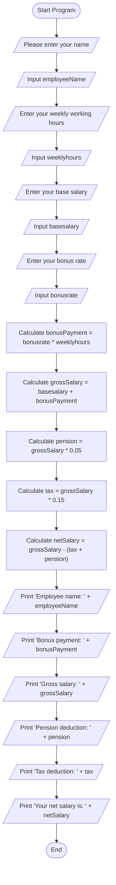

## Input

•	Employee name (employeeName)

•	Weekly working hours (weeklyhours)

•	Base salary (basesalary)

•	Bonus rate (bonusrate)

## Process

1.	Calculate the bonus payment using the formula: bonusPayment = bonusrate * weeklyhours.
2.	Calculate the gross salary using the formula: grossSalary = basesalary + bonusPayment.
3.	Calculate the pension using the formula: pension = grossSalary * pension_rate.
4.	Calculate the tax using the formula: tax = grossSalary * tax_rate.
5.	Calculate the net salary using the formula: netSalary = grossSalary - tax - pension.
	
## Output

•	Employee name

•	Bonus payment

•	Gross salary

•	Net salary

## Pseudocode for Salary Calculation

step 1. **Start**

step 2. **Initialize Variables**

    Declare string employee
     Declare float weeklyhours
    Declare `float bonusrate`
    Declare `float basesalary`
    Declare `float pension`
    Declare `float tax`
    Declare `float grossSalary`
    Declare `float bonusPayment`
    Declare `float netSalary`
    Declare `const float pension_rate = 0.05`
    Declare `const float tax_rate = 0.15`

step 3. **Input Employee Name**

step 4. **Input Weekly Working Hours**

step 5. **Input Base Salary**

step 6. **Input Bonus Rate**

step 7. **Calculate Bonus Payment**

 Compute bonusPayment = bonusrate * weeklyhours`
 
step 8. **Calculate Gross Salary**

   - Compute gross Salary = base salary + bonus Payment`
     
step 9. **Calculate Pension**

   - Compute pension = gross Salary * pension rate`
     
step 10. **Calculate Tax**
   Compute tax = gross Salary * tax rate
     
step 11. **Calculate Net Salary**

 net salary = gross salary - tax - pension
     
step 12. **print Results**

   employee name

   gross salary
   
   bonus payment
   
   net salary
    
step 13. **End**
# Flow chart

