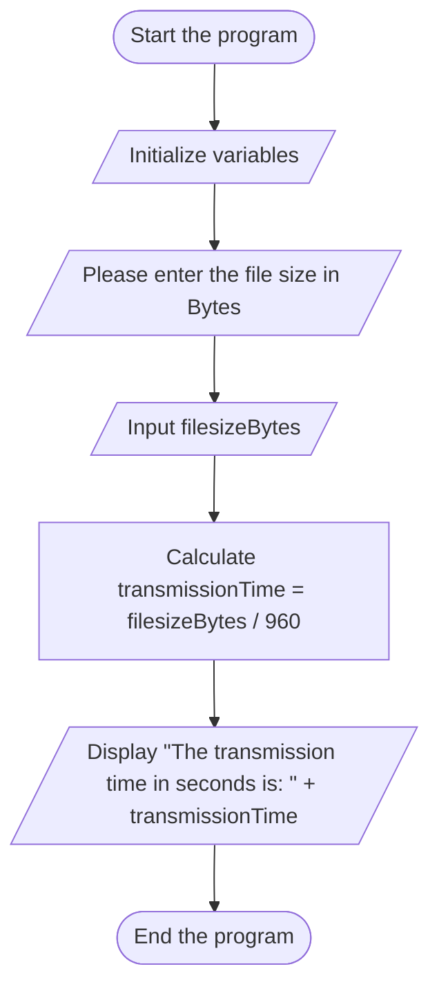

## Input
•	File size in Bytes (filesizeBytes)
## Process
1.	Prompt the user to enter the file size in Bytes.
2.	Read the file size.
3.	Calculate the transmission time as transmission Time =  filesizeBytes / transmissionRate.
## Output
•	The transmission time in seconds (transmission Time).

## Pseudocode for Transmission Time Calculation

1. **Start**
 
3. **Initialize Variables**
   
   - Declare `double filesize Bytes`
   - Declare `double transmission Time`
   - Declare `const double transmission Rate = 960`
5. **Input File Size**
   
7. **Calculate Transmission Time**
   
   - Compute transmission Time = filesize Bytes / transmissio nRate`
9. **Print Transmission Time**
    
11. **End**

